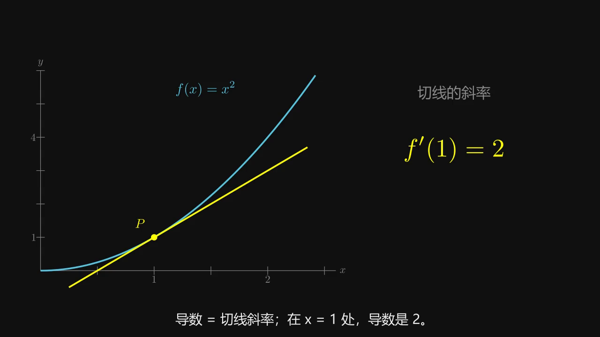

# Explainer Video Skill

让 Codex 用中文制作定制讲解视频：写讲稿和分镜，生成 Manim 动画，用本地 Kokoro 配音，导出 MP4、SRT 字幕和可重做源码。

默认采用类似 3Blue1Brown 的图解方式：连续几何变化、局部放大、颜色对应变量、公式逐步变换。新主题的内容和动画由 Codex 编写；这个 skill 提供制作流程和工具，示例本身不会因改标题而自动变成新主题。



[下载完整导数样片](examples/derivative.mp4?raw=true) · [查看字幕](examples/derivative.srt)

示例约 97 秒，720p / 30 fps，使用 Kokoro 中文男声。讲稿与画面为原创；本项目与 3Blue1Brown 没有关联。

## 需要什么

| 工具 | 用途 |
| --- | --- |
| Codex | 为新主题编写讲稿、分镜和动画代码 |
| Python 3.11 或 3.12 | 按下面的 PyPI 安装方式部署 |
| Manim Community 0.21.0 | 渲染动画 |
| Kokoro、Misaki 与 CPU PyTorch | 本地中文配音 |
| FFmpeg | 合成音视频 |
| 中文字体；示例另需 latex、dvisvgm 与 xcolor | 中文文字与数学公式 |

无需另配大模型或配音 API key，也不要求 GPU。首次安装需联网；安装完依赖并下载模型后，渲染与配音可在本地运行。Codex 自身的使用仍取决于你的账号和网络。

**空间**：仓库只有代码、文档和约 3 MB 的样片。中文模型加两个音色约 328 MB。Python 依赖、PyTorch、TeX 和渲染缓存另占空间；全新电脑的总占用会高于模型大小。优先复用已有工具，CPU 安装避免下载 CUDA 环境。

目前完整流程在 Windows 上验证。Python 主流程也可在其他系统运行，但未做完整验证；PowerShell 下载脚本和 Windows SAPI 后端仅适用于相应环境。以下步骤以 Windows PowerShell 为例。

## 安装 skill

```powershell
git clone https://github.com/MrRoam/explainer-video-skill.git "$env:USERPROFILE\.agents\skills\explainer-video"
Set-Location "$env:USERPROFILE\.agents\skills\explainer-video"
```

已有同名 skill 时先保留原目录，选择其他位置进行比较；不要直接覆盖已有配置。Codex 的用户级目录和调用方式见[官方 Skills 文档](https://learn.chatgpt.com/docs/build-skills)。安装后若当前窗口未显示该 skill，重启 Codex 再打开新窗口。

### 已有工具：只配置路径

使用下面的配置命令，把示例路径换成你的已有环境。这个脚本检查路径和必要依赖，不安装软件、不下载权重。

```powershell
python .\scripts\configure_runtime.py `
  --manim-python "D:\video-tools\manim-env\Scripts\python.exe" `
  --tts-python "D:\video-tools\kokoro-env\Scripts\python.exe" `
  --ffmpeg "D:\video-tools\ffmpeg\bin\ffmpeg.exe" `
  --model-directory "D:\video-tools\models\kokoro-zh"
```

如果 FFmpeg 在 PATH，或 Manim 环境已安装 `imageio-ffmpeg`，可省略 `--ffmpeg`。TeX 不在 PATH 时添加 `--tex-bin "TeX 程序目录"`。中文字体默认 `Microsoft YaHei`，也可用 `--font` 指定本机已有字体。女声用 `--voice zf_001`，默认男声为 `zm_010`。

配置保存在 `runtime.local.json`，Git 会忽略它。重配时加 `--force`。共享配置可用 `--output` 写到外部目录，再用 `EXPLAINER_RUNTIME` 或初始化脚本的 `--runtime` 读取。

### 没有工具：安装最小环境

先安装 Python 3.12，并确认 `py -3.12` 可用。两个独立环境方便单独复用和维护；不会修改全局 Python。

```powershell
py -3.12 -m venv .venv-manim
& .\.venv-manim\Scripts\python.exe -m pip install -r .\requirements-manim.txt

py -3.12 -m venv .venv-kokoro
& .\.venv-kokoro\Scripts\python.exe -m pip install --upgrade pip
& .\.venv-kokoro\Scripts\python.exe -m pip install "torch==2.10.0" --index-url https://download.pytorch.org/whl/cpu
& .\.venv-kokoro\Scripts\python.exe -m pip install -r .\requirements-kokoro.txt

powershell.exe -NoProfile -ExecutionPolicy Bypass -File .\scripts\download_kokoro.ps1 -ModelDirectory .\models\kokoro-zh

py -3.12 .\scripts\configure_runtime.py `
  --manim-python .\.venv-manim\Scripts\python.exe `
  --tts-python .\.venv-kokoro\Scripts\python.exe `
  --model-directory .\models\kokoro-zh
```

下载脚本固定官方中文模型修订，只下载配置、权重、男声 `zm_010` 和女声 `zf_001`，并校验 SHA-256。生成视频时不会再次下载模型。

导数示例使用 MathTex，需能执行 `latex` 和 `dvisvgm`，并提供 `xcolor`。已有 TeX 可直接复用；没有时按 [Manim 安装文档](https://docs.manim.community/en/stable/installation.html) 安装，或让 Codex 把公式改为 Text 与几何对象，避免为试玩安装整套 TeX。PyTorch 的 CPU 安装来源见[官方安装说明](https://pytorch.org/get-started/locally/)。

Kokoro 0.9.4 的 PyPI 包限制 Python 小于 3.13，所以上述安装路径采用 3.11 / 3.12。已有其他版本环境可复用，但需自行验证依赖兼容性。

## 开始使用

在 Codex 中说：

> 用 $explainer-video 做一个约一分钟的中文视频，解释梯度下降，面向初学者。采用 3Blue1Brown 那种连续图形推理风格。

也可先运行附带的导数示例。工作区使用独立目录：

```powershell
python .\scripts\init_project.py --workspace .\demo-workspace --name derivative
powershell.exe -NoProfile -ExecutionPolicy Bypass -File .\demo-workspace\outputs\derivative-project\run.ps1 -AudioOnly
powershell.exe -NoProfile -ExecutionPolicy Bypass -File .\demo-workspace\outputs\derivative-project\run.ps1 -Draft
powershell.exe -NoProfile -ExecutionPolicy Bypass -File .\demo-workspace\outputs\derivative-project\run.ps1
```

`-AudioOnly` 用于先检查旁白，`-Draft` 输出 480p 预览，最后一条输出 720p 成片。也可双击项目内的 `生成视频.cmd`。

新主题需要同时修改 `lesson.json` 和 `scene.py`。项目源文件在 `outputs/derivative-project`，MP4、字幕、讲稿和报告在 `outputs`，缓存位于 `work/explainer/derivative`。项目保存了本机工具路径；移动环境后应重新配置或更新项目中的 `tools.json`。

字段、时间同步、外部旁白接入和常见故障见 [制作说明](references/pipeline.md)。只读本机配置、初始化项目和运行视频不会调用付费 API。

## 验证范围

已在 Windows 验证 Manim + Kokoro CPU + FFmpeg 的完整导数样片，并检查时长、编码、分辨率和末段旁白。仓库中的轻量测试检查配置迁移、目录保护和离线模型入口；它们不评估画面和音色的主观质量。全新 Python 3.12 环境的安装命令未在空白机器上完整重装验证。

```powershell
python -m unittest discover -s tests -v
```

## 许可证

本仓库的原创代码、文档与示例使用 [MIT](LICENSE)。第三方工具、模型和音色使用各自的上游许可证，见 [NOTICE.md](NOTICE.md)。仓库不分发 Python 依赖、模型权重、字体、FFmpeg 或 TeX。
